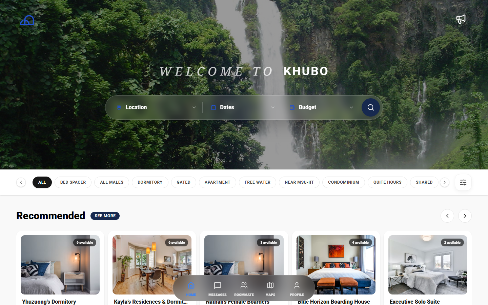

<div align="center">



# KHUBO

**Accommodation & Roommate Finder Platform**

A modern, full-featured web application designed to help users in Iligan City find short-term accommodations, long-term rentals, and compatible roommates.

Built with React 19, TypeScript 5.8, Tailwind CSS 4.1, and Vite 6.2.

[](https://react.dev)
[](https://www.typescriptlang.org)
[](https://vitejs.dev)
[](https://tailwindcss.com)
[](https://vitest.dev)
[](https://zod.dev)
[](LICENSE)

</div>

---

## Features

### For Travelers & Renters
- **Browse Listings** - Explore accommodations categorized by type (apartments, houses, condos, etc.)
- **Interactive Maps** - View property locations on an interactive map with MapTiler SDK 4.0
- **Advanced Filtering** - Filter listings by price, date, amenities, and location
- **Detailed Property Views** - Access comprehensive property information including photo galleries, amenities, host details, and reviews
- **Secure Booking Flow** - Streamlined modal-based booking interface
- **Search History** - Track your recent searches for quick access
- **Photo Galleries** - Full-screen photo carousel overlays for property images
- **Review Breakdowns** - Detailed review statistics and ratings at a glance

### For Roommate Seekers
- **Smart Matching** - Find compatible roommates based on university, budget, location preferences, and lifestyle tags
- **Create Posts** - Post roommate listings in "applying" or "finding" mode with personality traits
- **Detailed Profiles** - View potential roommates' bios, preferences, and compatibility factors
- **Hero Search** - Dedicated search interface for filtering roommate posts
- **Loading States** - Skeleton placeholders for smooth content loading

### For Hosts
- **Listing Management** - Create, edit, and manage your property listings through an intuitive dashboard
- **Profile Customization** - Showcase your hosting experience, work background, and property details
- **Review System** - Build trust through authentic guest reviews and ratings
- **Analytics Dashboard** - Track property performance with charts and statistics
- **Tenant Management** - View and manage tenants with status tracking (active, leaving, moved out) and payment status
- **Location Picker** - Interactive MapTiler-based map picker for precise property location selection
- **Landlord Signup** - Dedicated flow for hosts to upgrade their account
- **Inquiries Modal** - Manage guest inquiries from a centralized modal
- **Tenant Profiles** - View detailed tenant information and history

### User Experience
- **5-Step Onboarding Wizard** - Post-auth profile setup: identity → occupation → ID verification → review → finish
- **Authentication** - Secure sign-up and login functionality
- **Dark/Light Mode** - Toggle between themes for comfortable viewing in any environment
- **Responsive Design** - Fully optimized for mobile, tablet, and desktop devices
- **Bottom Navigation** - Mobile-friendly tab-based navigation
- **Smooth Animations** - Polished UI transitions using Motion library with accessibility-conscious reduced motion support
- **Toast Notifications** - Real-time feedback for user actions
- **Error Boundaries** - Graceful error handling with fallback UI components
- **Announcements** - View app news and updates via AnnouncementsOverlay
- **File Upload** - Drag-and-drop and file picker for image and document uploads
- **Legal Pages** - Terms of Service and Privacy Policy pages

---

## Quick Start

### Prerequisites

- [Node.js](https://nodejs.org/) (v18 or higher recommended)
- npm or yarn
- A [MapTiler](https://www.maptiler.com/) API key (for maps functionality)

### Installation

1. **Clone the repository**

   ```bash
   git clone <repository-url>
   cd khubo
   ```

2. **Install dependencies**

   ```bash
   npm install
   ```

3. **Set up environment variables**

   Create a `.env.local` file in the root directory with the following:

   ```env
   VITE_MAPTILER_API_KEY=your_maptiler_api_key
   ```

4. **Run the development server**

   ```bash
   npm run dev
   ```

5. **Open your browser**

   Navigate to `http://localhost:3002`

### Docker

Alternatively, run with Docker:

```bash
# Build and start
docker compose up --build

# Access at http://localhost:8080
```

---

## Pages & Routes

| Route | Description |
|-------|-------------|
| `/` | Home page with search, categories, and featured listing carousels |
| `/listing/:id` | Detailed view of a specific property with photo gallery, reviews, and booking |
| `/category/:categoryId` | Browse listings filtered by category |
| `/maps` | Split-panel map view with sidebar listing cards and MapTiler map |
| `/roommate` | Roommate finder with hero search, filter tags, and create post |
| `/profile` | User profile with stats, settings, landlord signup, and modals |
| `/manage-listings` | Host dashboard for managing properties with edit functionality |
| `/landlord/properties` | Landlord properties management page |
| `/landlord/tenants` | Landlord tenant management page |
| `/landlord/reviews` | Landlord reviews page |
| `/to-rate` | Pending reviews/ratings page |
| `/terms` | Terms of Service page |
| `/privacy` | Privacy Policy page |

---

## Available Scripts

| Command | Description |
|---------|-------------|
| `npm run dev` | Start development server on port 3002 |
| `npm run build` | Build for production |
| `npm run preview` | Preview production build locally |
| `npm run test` | Run Vitest test suite |
| `npm run test:watch` | Run Vitest in watch mode |
| `npm run lint` | Run ESLint and TypeScript checks |
| `npm run lint:eslint` | Run only ESLint |
| `npm run typecheck` | Run TypeScript type checking |
| `npm run format` | Format code with Prettier |
| `npm run clean` | Remove build artifacts |

---

## Tech Stack

### Frontend
- **React 19** - Latest version with concurrent features and improved hooks
- **React Router DOM 7** - Client-side routing with hash-based navigation
- **TypeScript 5.8** - Static typing for enhanced developer experience
- **Zod 4.4** - Type-safe schema validation for forms and data

### Build & Development
- **Vite 6.2** - Next-generation frontend build tool with HMR
- **Tailwind CSS 4.1** - Utility-first CSS framework
- **ESLint 9** - JavaScript/TypeScript linting
- **Prettier 3.8** - Code formatting

### UI & Animation
- **Motion (Framer Motion)** - Production-ready animation library
- **Lucide React** - Beautiful, consistent icon set
- **clsx & tailwind-merge** - Conditional className utilities
- **Recharts** - Composable charting library for analytics dashboards

### Maps & Location
- **MapTiler SDK 4.0** - Interactive maps and geolocation services

### Testing
- **Vitest 4.1** - Blazing fast unit test runner
- **React Testing Library** - React component testing utilities
- **jsdom** - DOM environment for tests

### Deployment
- **Docker** - Multi-stage build with nginx for production serving
- **nginx 1.27** - Production web server with SPA fallback and caching

---

## Project Structure

```
khubo/
├── public/                        # Static assets
├── src/
│   ├── components/               # Reusable UI components
│   │   ├── ui/                   # Base UI components (Modal, ErrorScreen, FocusTrap)
│   │   ├── errors/               # Error boundary components
│   │   ├── profile/              # Profile modals (EditProfile, LandlordSignup, Logout, StatCard)
│   │   └── *.tsx                 # Feature components (45+ files)
│   ├── pages/                    # Route-level components (13 pages)
│   ├── hooks/                    # Custom React hooks (8 hooks)
│   │   ├── useFocusTrap.ts       # Focus trap for modals
│   │   ├── useIsAnyModalOpen.ts  # Detect if any modal is open
│   │   ├── useListing.ts         # Single listing fetcher
│   │   ├── useListings.ts        # Listings collection fetcher
│   │   ├── useListingsFilter.ts  # Client-side listings filtering
│   │   ├── useMediaQuery.ts      # Responsive media query hook
│   │   └── useSearchHistory.ts   # Search history manager
│   ├── lib/                      # Core libraries and contexts
│   │   ├── api/                  # API integration layer (mock-backed)
│   │   │   ├── listings.ts       # Listings API
│   │   │   └── roommates.ts      # Roommates API
│   │   ├── AuthContext.tsx        # Authentication provider
│   │   ├── LandlordContext.tsx    # Landlord state provider
│   │   ├── ThemeContext.tsx       # Theme provider
│   │   ├── constants.ts          # App constants
│   │   ├── mapPreloader.ts       # Map SDK singleton preloader (hidden off-screen init)
│   │   ├── toastConfig.ts        # Toast notification configuration
│   │   └── utils.ts              # Utility functions
│   ├── mocks/                    # Mock data for development
│   │   ├── listings.ts           # Mock listing data
│   │   ├── reservations.ts       # Mock reservation data
│   │   └── roommates.ts          # Mock roommate data
│   ├── test/                     # Test setup and configuration
│   │   └── setup.ts              # Vitest setup with jsdom
│   ├── types.ts                  # TypeScript type definitions
│   ├── App.tsx                   # Root component with routing
│   └── main.tsx                  # Application entry point
├── Dockerfile                    # Multi-stage Docker build
├── docker-compose.yml            # Docker Compose configuration
├── index.html                    # HTML template
├── package.json                  # Dependencies and scripts
├── tsconfig.json                 # TypeScript configuration
├── vite.config.ts                # Vite configuration
├── tailwind.config.js            # Tailwind CSS configuration
└── eslint.config.js              # ESLint configuration
```

---

## Contributing

Contributions are welcome! Please follow these steps:

1. Fork the repository
2. Create a feature branch (`git checkout -b feature/amazing-feature`)
3. Commit your changes (`git commit -m 'feat: add amazing feature'`)
4. Push to the branch (`git push origin feature/amazing-feature`)
5. Open a Pull Request

Follow the [Conventional Commits](https://www.conventionalcommits.org/) specification for commit messages:

```
feat:     New feature
fix:      Bug fix
docs:     Documentation changes
style:    Code style changes (formatting, etc.)
refactor: Code refactoring
test:     Adding or updating tests
chore:    Maintenance tasks
```

---

## License

This project is licensed under the MIT License. See the [LICENSE](LICENSE) file for details.

---

*Last Updated: July 2, 2026*
